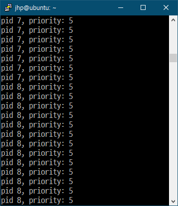
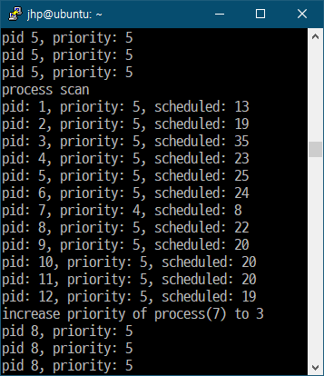
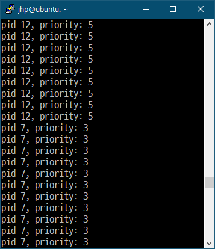
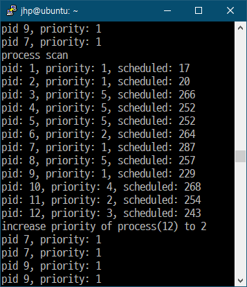

# xv6_priority_scheduler
xv6 운영체제 priority 스케줄러 구현
 
 
 

# 개발환경
Vmware workstation 16 player

ubuntu-18.04.6-desktop-amd64
 
 
 

# void scheduler(void) 함수 분석
기존의 스케줄러 함수는 이하의 루프를 반복한다
* 프로세서 인터럽트 활성화
* ptable 구조체 lock 획득
* ptable의 state가 RUNNABLE인 proc에 대해서
    * 그 proc 실행
    * 이후 proc이 yield시 루프 반복
* ptable 구조체 lock release

따라서 위 스케줄러는 모든 프로세스가 동일한 시간씩 cpu time을 점유하는 round robin 방식으로 동작하는 것을 알 수 있다.
 
 
 

# 새로운 스케줄러 전략
새로 작성된 스케줄러 전략은 대기 중인 프로세스를 priority 그룹으로 나누어서 priority가 높은 프로세스들은 cpu time을 많이 할당하고, priority가 낮은 프로세스에는 cpu time을 적게 할당하는 것이다. (우선순위가 1인 그룹이 10번 스케줄링 될 동안 우선순위가 10인 그룹은 1번 스케줄링 된다)

priority가 같은 그룹 내 프로세스들은 round robin방식으로 자원을 할당받는다.
또한 기아 문제를 해결하기 위해 상수 AGING_ROOF를 둔다. AGING_ROOF 상수는 컨텍스트 스위칭이 이 횟수만큼 발생하면 priority가 1이 아니면서 가장 실행된 횟수가 적은 프로세스의 priority가 1 증가하도록 한다.
 
 
 

# 수정 및 작성한 소스코드
### speak.c (신규)
이 함수를 호출한 프로세스의 pid와 priority를 출력하는 시스템 콜 작성
- - -
### proc.h 
line 52: proc 구조체에 priority를 나타내는 변수 추가
- - -
### proc.c
line 13: ptable 구조체에 각 프로세스별 스케줄러에 인해 실행된 횟수를 저장하는 select_count[] 변수 추가

line 24~25: priority 최대/최소값 상수

line 97: 새 프로세스 할당시 select count를 0으로 초기화

line 124: allocproc에서 프로세스 첫 할당시 priority값 5로 초기화

line 153: 첫 user process의 priority값 5로 초기화

line 216: fork시 자식 프로세스의 priority값을 부모 프로세스의 priority값과 동일하게 초기화

line 329~358: 가장 적게 스케줄링된 프로세스를 찾아서 우선도를 올려주는 함수

line 360~426: 스케줄러 함수

line 606~623: set_proc_priority() 시스템 콜 정의

line 625~639: get_proc_priority() 시스템 콜 정의
- - -
### defs.h	
line 123: set_proc_priority() 선언 추가

line 124: get_proc_priority() 선언 추가

line 191~192: speak() 선언 추가
- - -
### sysproc.c
line 93~107: set_proc_priority() 래퍼 함수 추가

line 109~118: get_proc_priority() 래퍼 함수 추가
- - -
### syscall.h
line 23: sys_set_proc_priority() 시스템 콜 번호 추가

line 24: sys_get_proc_priority() 시스템 콜 번호 추가

line 25: sys_speak() 시스템 콜 번호 추가
- - -
### syscall.c
line 106: sys_set_proc_priority() 선언 등록

line 107: sys_get_proc_priority() 선언 등록

line 108: sys_speak() 선언 등록

line 132: sys_set_proc_priority() 시스템 콜 테이블 등록

line 133: sys_get_proc_priority() 시스템 콜 테이블 등록

line 134: sys_speak() 시스템 콜 테이블 등록
- - -
### user.h
line 26: set_proc_priority() 선언 등록

line 27: get_proc_priority() 선언 등록

line 28: speak() 선언 등록
- - -
### usys.S
line 32: set_proc_priority() 등록

line 33: get_proc_priority() 등록

line 34: speak() 등록
- - -
### shouter.c (신규)
자신의 pid와 priority를 계속 출력하는 유저 프로그램 정의
- - -
### shout.c (신규)
N개의 shouter들을 생성하는 프로그램 정의
- - -
### MakeFile
line 30: speak.o 오브젝트 파일로 등록

line 185: shouter 유저 프로그램 등록

line 186: shout 유저 프로그램 등록

line 256: shouter, shout 유저 프로그램 등록
- - -
 
 
 

# 발생한 문제 및 해결 방법
문제 1: 테스트를 위해 생성한 프로세스들 간 콘솔 출력 동기화가 되지 않는 문제 발생(printf)

해결 1: speak 시스템 콜을 추가해서 콘솔 출력 동기화
* void speak(pid): 입력받은 pid 프로세스의 priority 를 콘솔에 출력(cprintf)
 
 
 

# 실행화면 및 테스트
### 테스트 환경
* 테스트를 위해 유저 프로그램 및 시스템 콜 추가
    * void speak(pid): 프로세스의 pid를 입력받아 pid와 priority를 콘솔에 출력하는 시스템 콜
    * shouter: 무한히 speak()를 실행하는 유저 프로그램
    * shout: 프로세스 숫자를 인자로 받아 그 수만큼 shouter 프로세스를 생성하는 유저 프로그램
* 테스트는 shout 10 으로 진행 (10개의 프로세스 생성)
* 각 프로세스는 자신의 pid와 priority를 콘솔에 무한히 출력
 
 
 
 
</img>
 
그림 1: 프로세스 생성

각 프로세스는 shout() 유저 프로그램에서 fork로 생성되었다.

그림1에서 프로세스의 priority 초기값이 5라는 것을 알 수 있다.
 
 
 

</img>
 
그림 2: 프로세스 에이징

그림 2는 스케줄링이 AGING_ROOF번 실행된 후, 현재 실행중인 프로세스들 중에서 가장 스케줄링된 횟수가 적은 프로세스의 priority를 증가시키는 그림이다.

Process scan에서 각 프로세스의 pid, priority, scheduled 값을 확인할 수 있다. scheduled값은 프로세스가 스케줄링된 횟수를 의미한다.

위 그림에서 scheduled값이 가장 작은 프로세스는 7번 프로세스이다. 또한 7번 프로세스의 priority값을 3으로 올리는 장면도 확인할 수 있다.
 
 
 

</img>
 
그림 3: 프로세스 priority 변경

그림 3에서는 7번 프로세스의 priority가 3으로 증가한 것을 볼 수 있다.
 
 
 

</img>
 
그림 4: priority가 1인 프로세스의 에이징

그림 4의 상황에서 scheduled값이 가장 작은 프로세스는 1번 프로세스지만, 스케줄러는 12번 프로세스의 우선도를 올리는 쪽을 택했다. 1번 프로세스는 priority가 1로, 최대 우선도 값이기 때문에 스케줄러는 1번 프로세스의 priority값을 증가시키지 않았다.

스케줄러는 priority가 1(최대값)이 아닌 프로세스들 중에서 scheduled값이 가장 작은 프로세스의 priority값을 증가시킨다는 것을 확인할 수 있다.
따라서 위 스케줄러에서는 기아 상태에 빠지는 프로세스가 없을 것이다.
